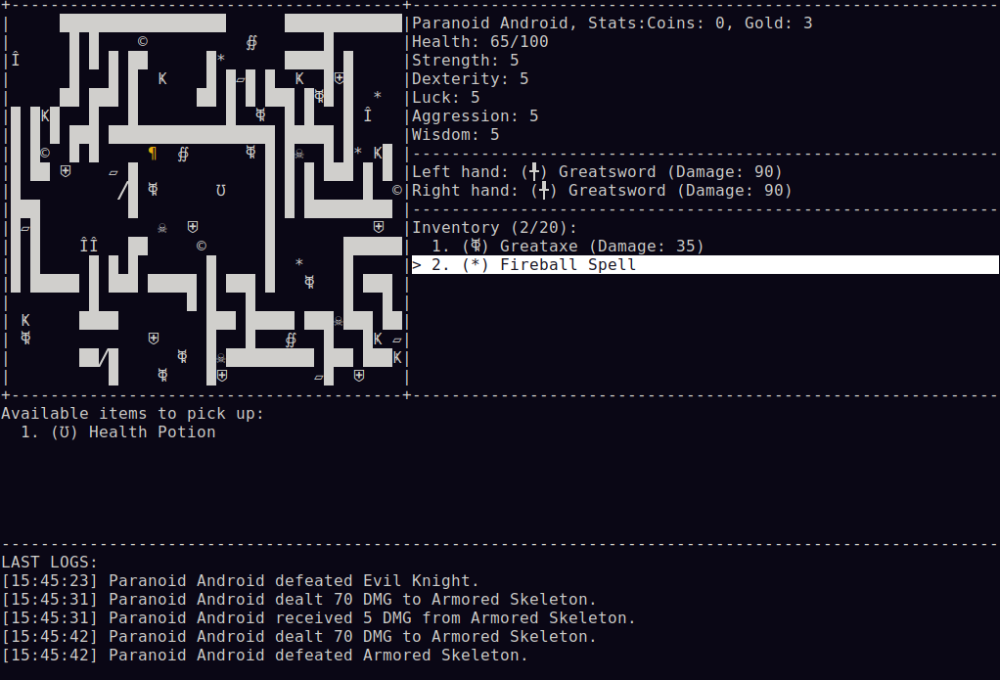
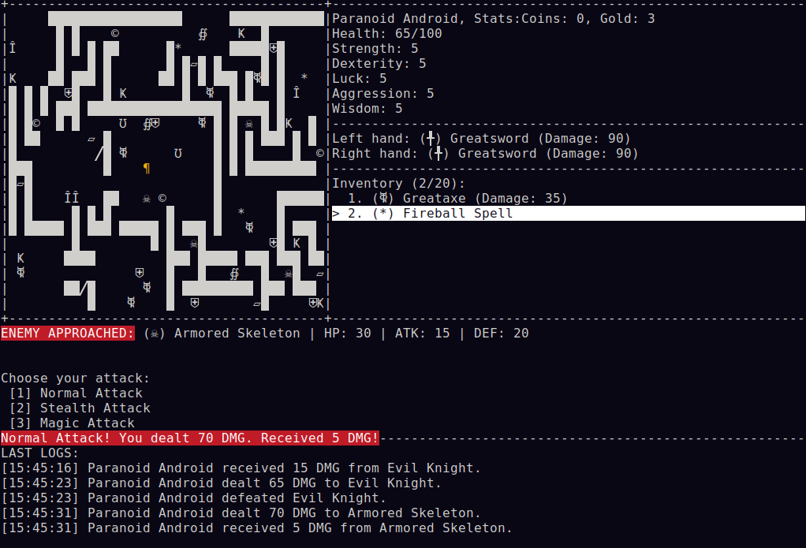

# Dungeon RPG

A console-based dungeon crawler written in C#, developed for the **Object-Oriented Design** course at the Faculty of Mathematics and Information Science, Warsaw University of Technology. The project serves as a practical study of classical design patterns applied within a working game architecture.

---

## Table of Contents

- [Overview](#overview)
- [Design Patterns](#design-patterns)
- [Requirements](#requirements)
- [Getting Started](#getting-started)
- [Controls](#controls)
- [Gameplay](#gameplay)
- [Project Structure](#project-structure)
- [Architecture](#architecture)

---

## Overview

The player navigates a procedurally generated ASCII dungeon, engages enemies in combat, and manages a dual-wield inventory of weapons and spells. Each run is shaped by a theme-driven factory, producing a distinct layout, enemy composition, and item pool. The game supports both local singleplayer and multi-player sessions over TCP with up to 9 simultaneous players.

Key features:

- **Procedural dungeon generation** via Builder and Strategy patterns — six interchangeable terrain strategies (Default, BossArena, FieldWithItems, RandomCorridorMaze, RandomRoomMaze)
- **Three distinct themes** — Cursed Castle, Jungle Maze, and Crimson — each supplying unique enemies and weapons through an Abstract Factory
- **Twelve enemy types** — Goblin, Evil Knight, Armored Skeleton, Possessed Armor, Bat, Minotaur, Giant Spider, Eye of Cthulhu, Flesh Golem, Snake, The Twins — each with individual flocking behaviour
- **Full character sheet** — Health, Strength, Dexterity, Luck, Aggression, and Wisdom stats, plus Coins and Gold currency
- **Dual-wield equipment** — separate left-hand and right-hand weapon slots, each with its own damage value
- **Three attack modes** — Normal Attack, Stealth Attack, and Magic Attack, selectable each combat round
- **Weapon modifier system** — Decorator pattern wrapping weapons with Heavy, Strong, or Unlucky modifiers that alter stats
- **20-slot inventory** — carry weapons, spells, artifacts, consumables, and swap them mid-dungeon
- **Acoustic system** — dropping a weapon generates noise that attracts nearby enemies within range via BFS propagation
- **Species network** — when an enemy is killed, its kin in the dungeon are alerted via an Observer hub
- **Timestamped event log** — combat events written to an in-memory log visible at the bottom of the screen, and optionally to a file on disk
- **MVC architecture** — clean separation between game model, `ConsoleView` rendering, and `PlayerController` input handling
- **Multi-player over TCP** — authoritative server broadcasts `GameStateDto` as newline-delimited JSON to up to 9 clients; clients send `PlayerActionDto` commands back
- **JSON configuration** — player name, log directory, and other settings loaded from `Config/game_config.json`

---

## Design Patterns

| Pattern | Implementation |
|---|---|
| Builder | `DefaultDungeonBuilder` assembles terrain, enemies, and items into a complete room |
| Strategy | Six pluggable terrain generation strategies (`DefaultTerrainStrategy`, `BossArenaStrategy`, `RandomRoomMazeStrategy`, etc.) |
| Abstract Factory | `IThemeFactory` and its three concrete factories supply theme-consistent enemies and weapons |
| Chain of Responsibility | Input handlers (`MovementInputHandler`, `CombatInputHandler`, `InventoryInputHandler`, etc.) form an ordered chain |
| Visitor | `NormalAttackVisitor`, `StealthAttackVisitor`, and `MagicAttackVisitor` compute damage without coupling `Player` and `Enemy` directly |
| Observer | `SpeciesNetwork` propagates death events across a species; `DungeonAcoustics` propagates sound events when items are dropped |
| Composite | `CompositeLogger` fans a single log call out to any number of attached loggers |
| Decorator | `WeaponDecorator` and its modifiers (`HeavyModifier`, `StrongModifier`, `UnluckyModifier`) wrap weapons to alter their properties |
| Pattern Matching | `Weapon.GetNoiseRange()` resolves noise level using a `switch` expression over marker interfaces |
| MVC | `Game`/`Room` act as Model; `ConsoleView : IGameView` handles all rendering; `PlayerController` captures input and emits `PlayerActionDto` |

---

## Requirements

- [.NET 9 SDK](https://dotnet.microsoft.com/download) or later
- A terminal with UTF-8 support (Windows Terminal or iTerm2 recommended)

---

## Getting Started

```bash
git clone https://github.com/m00fi/dungeon-rpg-project.git
cd dungeon-rpg-project/rpg-project
dotnet run                            # interactive menu (local / server / client)
dotnet run -- --server 5555          # start an authoritative game server on port 5555
dotnet run -- --client 127.0.0.1:5555  # connect as a client
```

Before running, you can customise `dungeonRPG/Config/game_config.json`:

```json
{
  "PlayerName": "Hero",
  "LogDirectory": "Logs"
}
```

---

## Controls

| Key | Action |
|---|---|
| W / A / S / D | Move up / left / down / right |
| E | Pick up item on the current tile |
| Q | Drop the currently held item |
| 1 / 2 / 3 | Select attack type during combat (Normal / Stealth / Magic) |
| J | Display the in-session event log |
| Escape | Exit the game |

Moving onto a tile occupied by an enemy initiates combat and prompts for an attack choice.

---

## Gameplay





---

## Project Structure

```
rpg-project/
├── global.json
├── rpg-project.sln
└── dungeonRPG/
    ├── Program.cs                        # Entry point; parses --server / --client args or shows interactive menu
    ├── Game.cs                           # Main game loop: NPC movement and local play coordination
    ├── dungeonRPG.csproj
    │
    ├── Config/
    │   ├── GameConfig.cs                 # Loads settings from game_config.json
    │   └── game_config.json              # Runtime configuration (player name, log directory)
    │
    ├── UI/                               # View layer (MVC)
    │   ├── IGameView.cs                  # Render contract
    │   ├── ConsoleView.cs                # Draws map, stats, and event log from GameStateDto
    │   ├── Display.cs                    # Low-level console drawing helpers
    │   ├── Menu.cs                       # Generic menu component
    │   └── DungeonSelectionMenu.cs       # Theme picker shown at startup
    │
    ├── Dungeon/                          # Map module (Model)
    │   ├── Room.cs                       # 2D grid of Cell objects; drives enemy movement each tick
    │   ├── Cells/
    │   │   ├── Cell.cs                   # Base cell type
    │   │   ├── EmptyCell.cs
    │   │   └── WallCell.cs
    │   └── Generation/
    │       ├── IDungeonBuilder.cs
    │       ├── DefaultDungeonBuilder.cs  # Builder that composes terrain, enemies, and items
    │       └── Strategies/               # Pluggable terrain generation strategies
    │           ├── IDungeonGenerationStrategy.cs
    │           ├── DefaultTerrainStrategy.cs
    │           ├── BossArenaStrategy.cs
    │           ├── FieldWithItemsStrategy.cs
    │           ├── RandomCorridorMazeStrategy.cs
    │           └── RandomRoomMazeStrategy.cs
    │
    ├── Entities/                         # Live objects on the map (Model)
    │   ├── Player.cs                     # Player character: dual-wield slots, inventory, currency
    │   ├── Modules/                      # Player subsystems extracted into focused classes
    │   │   ├── Attribute.cs              # Stat block (Strength, Dexterity, Luck, etc.)
    │   │   ├── Equipment.cs              # Left/right weapon slot management
    │   │   ├── Inventory.cs              # 20-slot item container
    │   │   └── Money.cs                  # Coin and Gold wallet
    │   └── Enemies/
    │       ├── Enemy.cs                  # Enemy base class; exposes flocking behaviour hooks
    │       ├── Goblin.cs
    │       ├── EvilKnight.cs
    │       ├── ArmoredSkeleton.cs
    │       ├── PossessedArmor.cs
    │       ├── Bat.cs
    │       ├── Minotaur.cs
    │       ├── GiantSpider.cs
    │       ├── EyeOfCthulhu.cs
    │       ├── FleshGolem.cs
    │       ├── Snake.cs
    │       └── TheTwins.cs
    │
    ├── Items/                            # Collectible objects
    │   ├── IItem.cs                      # Base item interface, including GetNoiseRange()
    │   ├── Weapons/
    │   │   ├── Weapon.cs                 # Weapon base class; noise level resolved via pattern matching
    │   │   ├── OneHandedWeapon.cs
    │   │   ├── TwoHandedWeapon.cs
    │   │   ├── Greataxe.cs
    │   │   ├── Greatbow.cs
    │   │   ├── Machete.cs
    │   │   ├── Spear.cs
    │   │   ├── Staff.cs
    │   │   ├── WeaponCategories/
    │   │   │   └── WeaponCategories.cs   # Marker interfaces: IHeavyWeapon, IMagicWeapon, ILightWeapon
    │   │   └── WeaponModifiers/          # Decorator pattern
    │   │       ├── WeaponDecorator.cs    # Abstract base decorator
    │   │       ├── HeavyModifier.cs
    │   │       ├── StrongModifier.cs
    │   │       └── UnluckyModifier.cs
    │   ├── Artifacts/                    # Unique themed weapons
    │   │   ├── Greatsword.cs
    │   │   ├── OpticStaff.cs
    │   │   └── VineWhip.cs
    │   ├── Currencies/
    │   │   ├── Currency.cs
    │   │   ├── Coin.cs
    │   │   └── Gold.cs
    │   └── Others/                       # Consumables and equipment
    │       ├── Other.cs
    │       ├── Fireball.cs
    │       ├── HealthPotion.cs
    │       └── Quiver.cs
    │
    ├── Input/                            # Controller layer (MVC) — Chain of Responsibility
    │   ├── IInputHandler.cs
    │   ├── BaseInputHandler.cs
    │   ├── GameAction.cs                 # Enum of recognised game actions
    │   ├── InputResult.cs
    │   ├── PlayerController.cs           # Reads Console.ReadKey and emits PlayerActionDto
    │   └── Handlers/
    │       ├── MovementInputHandler.cs   # W/A/S/D and wall collision
    │       ├── CombatInputHandler.cs     # Enemy tile collision — dispatches attack Visitor
    │       ├── InventoryInputHandler.cs  # E (pick up) and Q (drop)
    │       ├── GroundInputHandler.cs     # Ground item interaction
    │       ├── GlobalActionHandler.cs    # J (log), Escape, etc.
    │       ├── ExitGameHandler.cs
    │       └── UnboundKeyHandler.cs      # Fallback for unmapped keys
    │
    ├── Combat/                           # Visitor pattern
    │   ├── IAttackVisitor.cs
    │   ├── NormalAttackVisitor.cs        # Standard damage calculation
    │   ├── StealthAttackVisitor.cs       # Sneak-attack multiplier
    │   └── MagicAttackVisitor.cs         # Magic damage formula
    │
    ├── Themes/                           # Abstract Factory pattern
    │   ├── IThemeFactory.cs
    │   ├── CursedCastleThemeFactory.cs
    │   ├── JungleMazeThemeFactory.cs
    │   └── CrimsonThemeFactory.cs
    │
    ├── Logging/                          # Composite + Strategy
    │   ├── ILogger.cs
    │   ├── GameLogger.cs                 # Static global wrapper
    │   ├── MemoryLogger.cs               # Retains timestamped entries for in-game display
    │   ├── FileLogger.cs                 # Writes entries to a .log file
    │   └── CompositeLogger.cs            # Fans one log call out to multiple loggers
    │
    └── Systems/                          # Observer-based global systems
        ├── Acoustics/
        │   ├── DungeonAcoustics.cs       # Hub: broadcasts noise events when items are dropped
        │   └── IAcousticObserver.cs
        ├── Species/
        │   ├── ISpeciesSubject.cs
        │   ├── ISpeciesObserver.cs
        │   └── SpeciesNetwork.cs         # Hub: notifies all members of a species on a death event
        ├── Pathfinding/
        │   └── Pathfinder.cs             # BFS pathfinding that routes around walls
        └── Network/
            ├── GameServer.cs             # Authoritative TCP server; up to 9 clients, lock-guarded model
            ├── GameClient.cs             # Lightweight client: receives GameStateDto, sends PlayerActionDto
            └── Data/                     # Data Transfer Objects for JSON serialisation
                ├── GameStateDto.cs       # ASCII map grid, player positions/stats, event log snapshot
                ├── PlayerActionDto.cs    # Command sent by client (move, attack, pick up, etc.)
                ├── PlayerActionType.cs   # Enum of action types
                ├── PlayerInfoDto.cs      # Flat player snapshot (HP, stats, position)
                ├── EnemyInfoDto.cs       # Flat enemy snapshot
                └── WelcomeDto.cs         # Initial handshake packet (assigned player ID)
```

---

## Architecture

The codebase follows a strict MVC separation. In multi-player mode the server holds the authoritative model and broadcasts state to all clients over raw TCP; clients are display-only and send input back as JSON commands.

```
                          ┌──────────────────────────┐
                          │      GameServer (TCP)     │
                          │  lock(_modelLock) guards  │
                          │  all model mutations      │
                          └────────────┬─────────────┘
                                       │ broadcast GameStateDto (JSON + \n)
              ┌────────────────────────┼────────────────────────┐
              │                        │                        │
   ┌──────────▼──────────┐  ┌──────────▼──────────┐  ┌─────────▼───────────┐
   │     GameClient      │  │     GameClient      │  │     GameClient      │
   │  (player 1…9)       │  │                     │  │                     │
   │                     │  │                     │  │                     │
   │  PlayerController   │  │  PlayerController   │  │  PlayerController   │
   │  (reads keyboard)   │  │                     │  │                     │
   │       │             │  │       │             │  │       │             │
   │       ▼             │  │       ▼             │  │       ▼             │
   │  ConsoleView        │  │  ConsoleView        │  │  ConsoleView        │
   │  (renders DTO)      │  │  (renders DTO)      │  │  (renders DTO)      │
   └─────────────────────┘  └─────────────────────┘  └─────────────────────┘
         │ PlayerActionDto (JSON + \n)
         └──────────────────────────────────────► GameServer
```

In local singleplayer mode the same MVC layers are used without the network — `PlayerController` drives the model directly and `ConsoleView` renders the `GameStateDto` produced in-process.

---

*Academic project — MiNI WUT, Object-Oriented Design course.*
